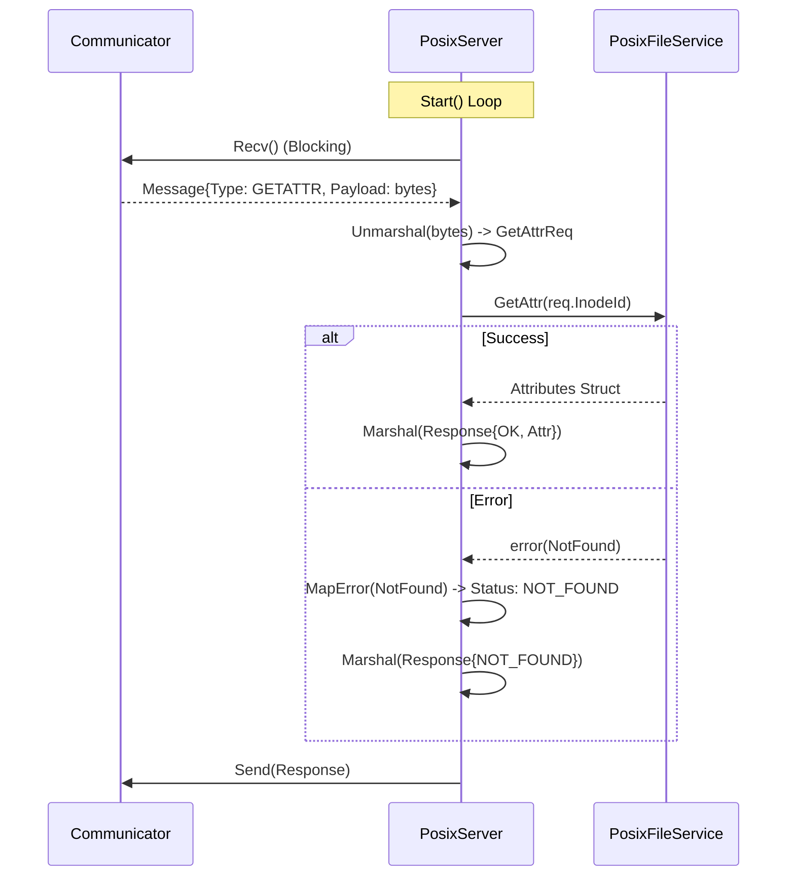

# POSIX Server Design

### Process

- [ ] **Goals** → Define the specific responsibilities of the Server component.
- [ ] **User stories** → Developer-centric stories (how the system interacts with this component).
- [ ] **Data models** → The internal structures required for the server state.
- [ ] **Nail an MVP** → The minimum set of RPC handlers required.
- [ ] **Draw the prototype** → The flow of the "Controller" loop.
- [ ] **Future** → Middleware, Interceptors, Auth.
- [ ] **Drill into specific components** → Interface definitions and Implementation details.
- [ ] **Pick a stack** → Go.
- [ ] **Actual software development**.

### Goals

#### Vision and Purpose

The `PosixServer` acts as the entry point (Gateway) for the Sandstore node. It completely abstracts the networking layer (`Communicator`) from the logic layer (`PosixFileService`).

It enforces the "Controller" pattern: it actively pulls work from the network, orchestrates the execution, and pushes the result back.

#### Functional Goals

-   **Protocol Translation**: Convert raw wire messages (from `Communicator`) into strongly typed function calls on the `PosixFileService`.
-   **Error Mapping**: Catch Go errors returned by the `PosixFileService` and translate them into the appropriate POSIX-style error codes (or gRPC status codes) for the client.
-   **Statelessness**: Process each request independently without maintaining session state between RPCs.

#### Non-Functional Goals

-   **Graceful Shutdown**: The server must stop accepting new messages and finish current processing when a shutdown signal is received.
-   **Observability**: Every RPC request/response cycle must be logged (method name, latency, error code).

### User Stories (System/Developer Focus)

-   **Server Lifecycle**: As a `main` process, I want to `Start()` the server with a `PosixFileService` and a `Communicator` dependency, so that it begins the event loop.
-   **Request Dispatch**: As the server, when I receive a `GetAttrRequest` message, I want to unmarshal it and call `fileService.GetAttr()`, so that the business logic is executed without knowing about the network.
-   **Error Translation**: As the server, when `fileService.Read()` returns a `fs.ErrPathNotFound`, I want to catch this and generate a response with `Status: NOT_FOUND`, so that the client receives a standard error.
-   **Response Delivery**: As the server, after processing a request, I want to marshal the result and use the `Communicator` to send it back to the specific client that made the request.
-   **Unknown Messages**: As the server, if I receive a message type I do not understand, I want to log a warning and return an `INTERNAL_ERROR` or `UNIMPLEMENTED` to the client.

### Data Models

The Server is mostly stateless, but it holds references to its dependencies.

#### `PosixServer` Struct

```go
type Server struct {
    // Dependencies injected at startup
    communicator  communication.Communicator
    fileService   posix_fs.PosixFileService
    logger        log_service.Logger
    
    // Config
    shutdownCh    chan struct{}
}
```

#### Message Types (Reference)
The Server interacts with the `communication.Message` struct (existing).

-   **Type**: `Enum` (`GETATTR`, `READ`, `WRITE`, etc.)
-   **Payload**: `[]byte` (Protobuf serialized data)
-   **Source**: `string` (Client address/ID for the reply)

### MVP

The MVP must implement handlers for all RPCs defined in the `[Feature: POSIX compliance]` document:

-   `GETATTR`
-   `SETATTR`
-   `LOOKUP`
-   `ACCESS`
-   `READ`
-   `WRITE`
-   `CREATE`
-   `MKDIR`
-   `REMOVE`
-   `RMDIR`
-   `RENAME`
-   `READDIR`
-   `READDIRPLUS`
-   `FSSTAT`
-   `FSINFO`

Excluded from MVP: Authentication, Session Management, Complex Middleware chains.

### Prototyping (The Controller Loop)

Since we are using Scenario B (Controller/Pull), the architecture is an infinite loop running in a goroutine.



### Project Future

#### Future Extensions

-   **Interceptor/Middleware Pattern**: Add a chain of handlers before the `switch` statement to handle logging, metrics, and auth uniformly.
-   **Context Propagation**: If the `Communicator` supports headers, propagate a `context.Context` with deadlines to the `FileService`.
-   **Concurrency Worker Pool**: Currently, the design implies a serial loop (processing one request at a time per server instance) or launching a goroutine per request.

**Decision for MVP**: Launch a goroutine per request (`go s.handleRequest(msg)`) to ensure one slow disk IO doesn't block the network listener.

### Specific Components

#### 1. Interface Definition
We need a clean interface for the server so it can be swapped or mocked.

`sandstore/internal/posix_server/posix_server.go`

```go
package posixserver

import "context"

// PosixServer defines the behavior of the network-facing component.
type PosixServer interface {
    // Start begins the main event loop. It blocks until the context is cancelled
    // or a fatal error occurs.
    Start(ctx context.Context) error
}
```

#### 2. Implementation Details
The implementation will reside in `sandstore/internal/posix_server/simple/server.go` (or `default_server.go`).

##### Key Components of the Implementation:

The Loop:

```go
func (s *server) Start(ctx context.Context) error {
    for {
        select {
        case <-ctx.Done():
            return ctx.Err()
        default:
            // 1. Pull message
            msg, err := s.communicator.Recv()
            if err != nil {
                // handle transport error
                continue
            }

            // 2. Dispatch asynchronously to avoid blocking the loop
            go s.handleMessage(ctx, msg)
        }
    }
}
```

The Dispatcher (`switch` Statement):

```go
func (s *server) handleMessage(ctx context.Context, msg *comm.Message) {
    var response []byte
    var err error

    switch msg.Type {
    case comm.MsgType_GETATTR:
        response, err = s.handleGetAttr(msg.Payload)
    case comm.MsgType_READ:
        response, err = s.handleRead(msg.Payload)
    // ... other cases
    default:
        // Handle unknown
    }

    // Send reply
    s.communicator.Send(msg.Source, response)
}
```

Error Mapper: A dedicated helper to keep the handlers clean.

```go
func mapErrorToStatus(err error) comm.Status {
    switch err {
    case fs.ErrNotFound:
        return comm.Status_NOT_FOUND
    case fs.ErrPermissionDenied:
        return comm.Status_ACCESS_DENIED
    case fs.ErrAlreadyExists:
        return comm.Status_ALREADY_EXISTS
    default:
        return comm.Status_INTERNAL_ERROR
    }
}
```

#### 3. Handler Example (`GetAttr`)
This demonstrates the "Translation" logic.

```go
func (s *server) handleGetAttr(payload []byte) (*comm.Message, error) {
    // 1. Deserialize
    var req pb.GetAttrRequest
    if err := proto.Unmarshal(payload, &req); err != nil {
        return s.makeErrorResponse(comm.Status_INVALID_ARGUMENT), nil
    }

    // 2. Call Logic
    attrs, err := s.fileService.GetAttr(req.InodeId)
    
    // 3. Handle Logic Error
    if err != nil {
        status := mapErrorToStatus(err)
        return s.makeErrorResponse(status), nil
    }

    // 4. Success Response
    resp := &pb.GetAttrResponse{
        Attr: convertToProtoAttr(attrs), // Helper to convert internal model to proto
    }
    
    // 5. Serialize
    bytes, _ := proto.Marshal(resp)
    return s.makeResponse(bytes), nil
}
```

### Stack

-   **Language**: Go
-   **Serialization**: Protocol Buffers (via the existing `proto/` definitions).
-   **Concurrency**: Goroutines for request handling to allow parallel IO.
